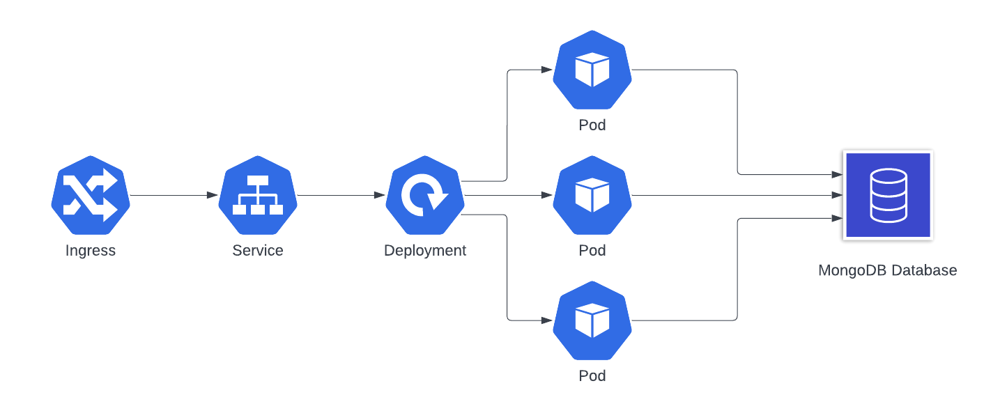

# Movies API

This repository contains:
* A .Net webapi application that allows querying of a MongoDB cloud hosted database containing movie data
* A docker file used to containerise the application
* Kubernetes configuration files to allow the creation of a Kubernetes deployment and service to run the containerised application at scale

## Running the Application Locally
The application can be run locally, provided dotnet 6.0 is installed, using the following steps:
1. `cd MoviesApi`
2. `dotnet run`

## Running the application from a container
The application container is hosted in an Elastic Container Registry (ECR) repository at `public.ecr.aws/k8y8g0w4/moviesapi:latest`.

## Folder Structure
The repository is organised into 2 main folders:

### MoviesAPI
This contains the application code, and configuration files required to run the application.  It also contains the Dockerfile used to build the application image 

### K8s
This contains the Kubernetes configuration files required to run the application on Kubernetes, including:
* Kubernetes Deployment definition
* Kubernetes Service definition
* Kubernetes Ingress definition

## Application Structure
The application separates out the data model, api, and data access layer into folders named 'Models', 'Controllers', and 'DataAccessLayer' retrospectively.

The Models folder consists of interfaces and classes that model the data structure of the movie data.

The Controllers folder consists of a single 'MovieController' that provides the necessary api endpoint to easily query data.

The DataAccessLayer folder contains the logic that is required to access the MongoDB, cloud hosted database.  There is also a Mock data access layer than can be used for local testing.

## Application Concepts

### Interfaces and Dependency Injection
Interfaces are used for both the DataAccessLayer and the Model classes, these means that different definitions can be easily swapped in and out with needing to make changes to the Controllers, and therefore api endpoint logic.

Dependency injection allows for implementations of an interface to be provided at runtime, the configuration that defines the specific implementation of an interface to be provided is contained in the `Program.cs` file.

## Database

The movie data resides in a MongoDB cloud database which is accessible to the application.
